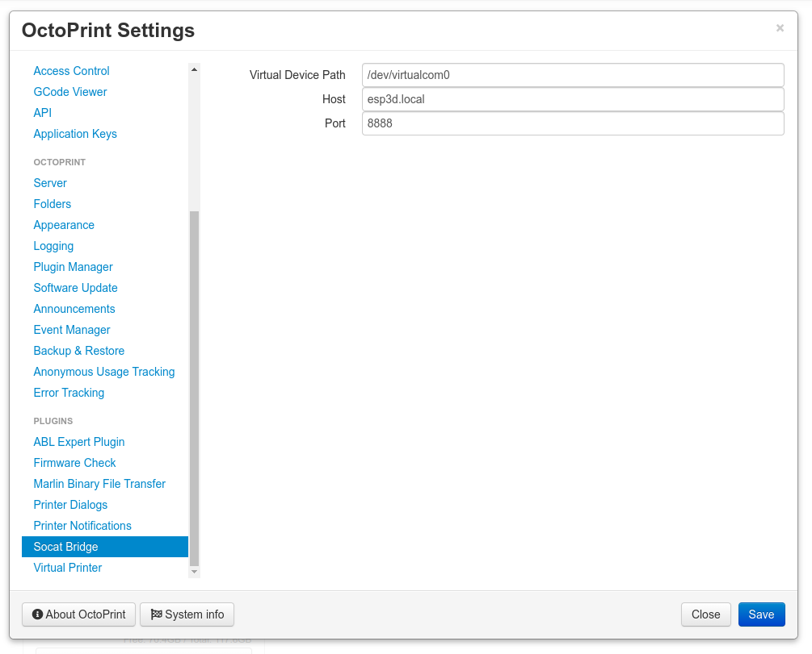
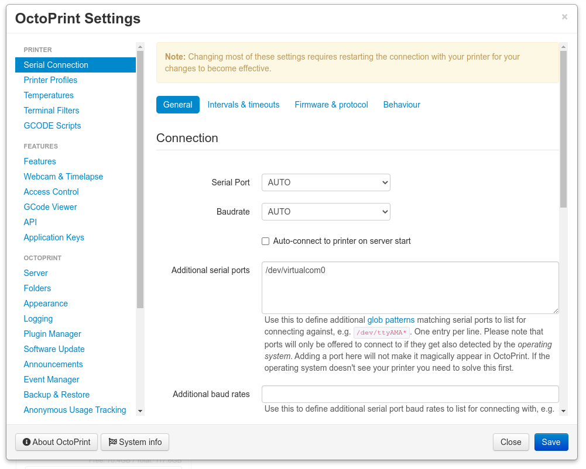

# OctoPrint-Socat-Bridge

Plugin to use socat to create a local device for a tcp serial connection (as offered by https://github.com/luc-github/ESP3D on port 8888)

## Socat
The required socat application is shipped as source code and compiled during installation. That is why the installation might take a while. As of now, the octoprint docker container ships all the required tools for compiling. Building from source should allow to use this plugin on any architecture (although I only tested it on a raspberry pi).

## Setup

Install via the bundled [Plugin Manager](https://github.com/foosel/OctoPrint/wiki/Plugin:-Plugin-Manager)
or manually using this URL:

    https://github.com/blenk92/octoprint-socat-bridge/archive/refs/heads/master.zip

## Configuration

Configure the plugin:

Add the new serial device:

